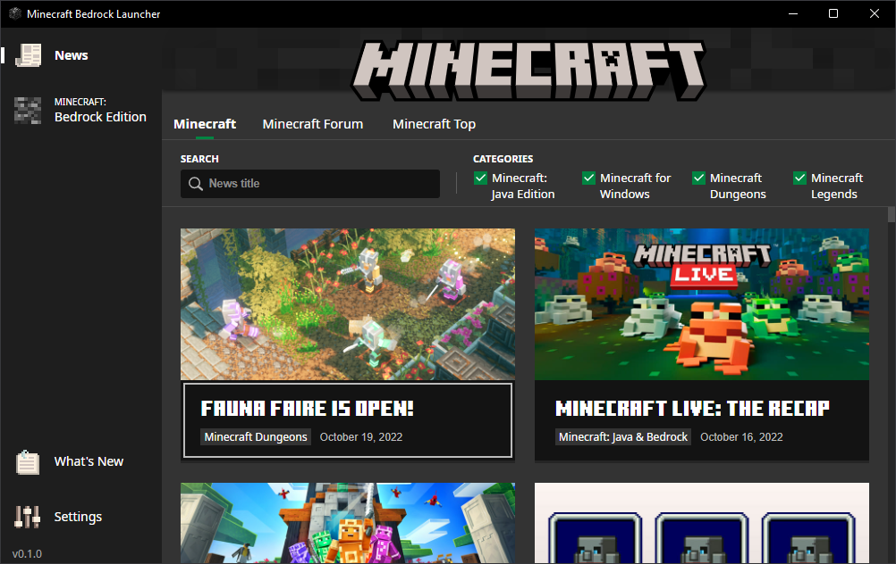
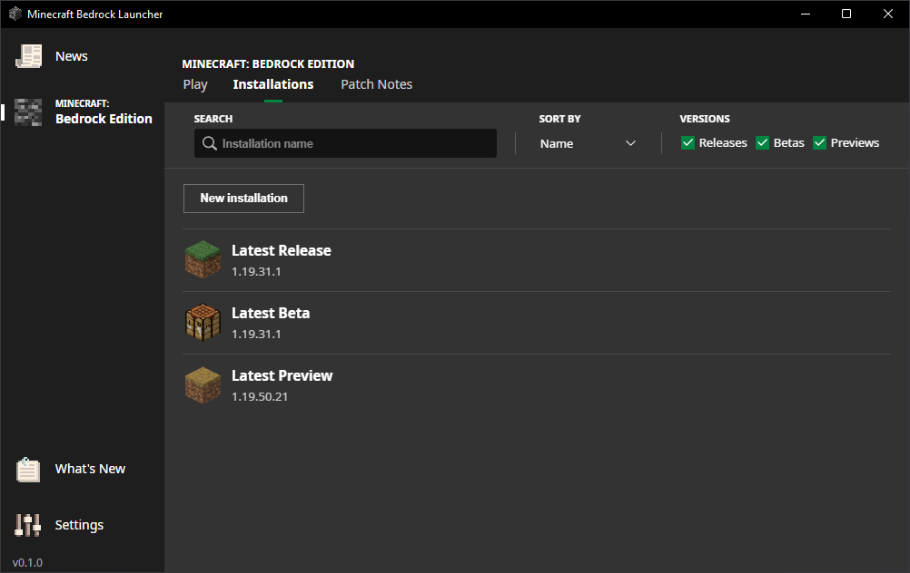
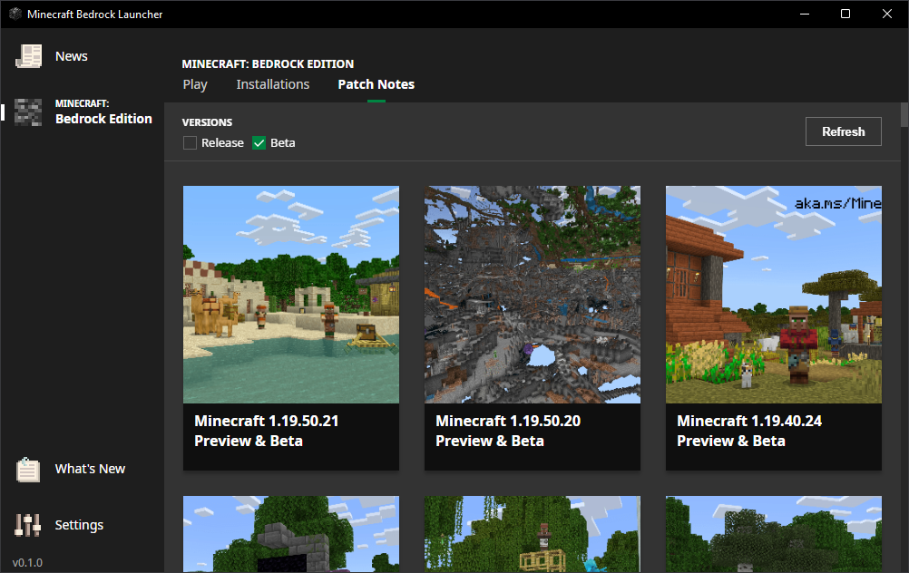
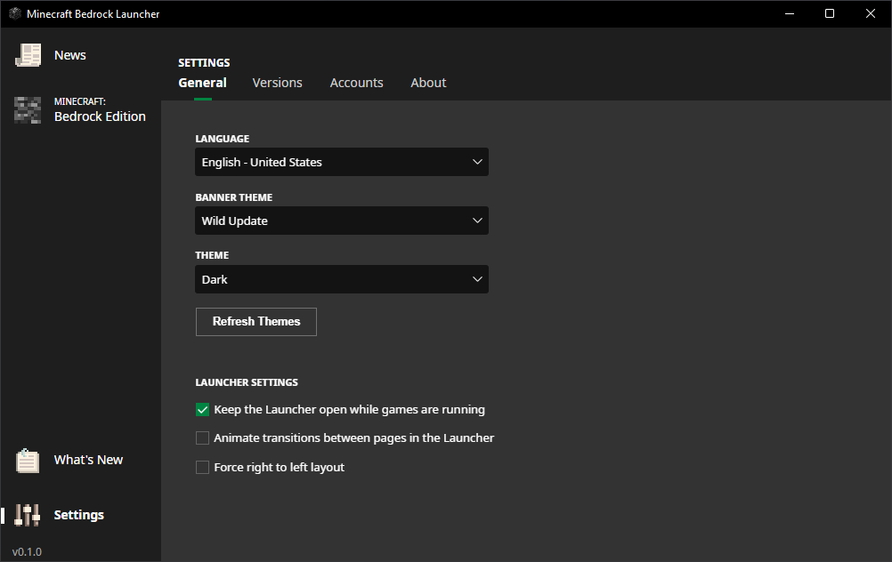
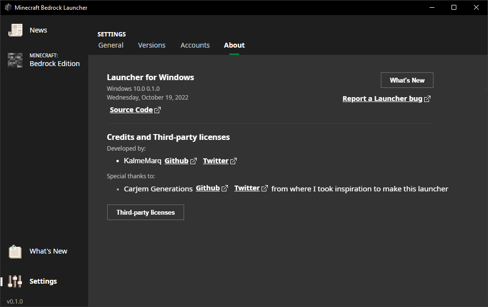

# Minecraft Bedrock Launcher (Probably I'm not gonna finish. So ignore this repo)

You can change the launcher content path. **Important: If you want to change it, do it before you install any mc version. Otherwise, when you try to change path it will take way longer.**

## Screenshots

